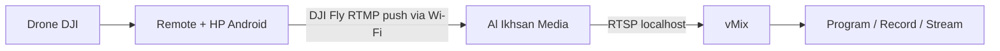
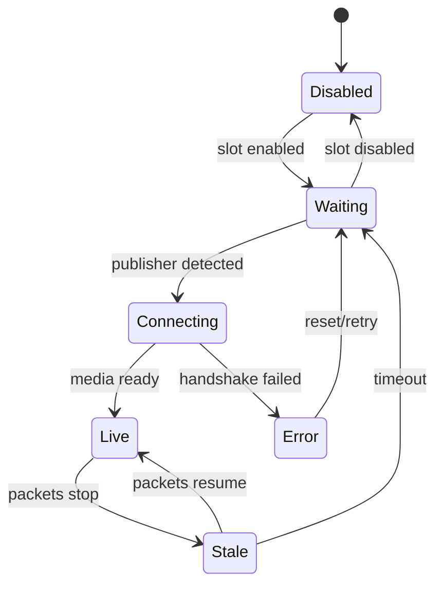
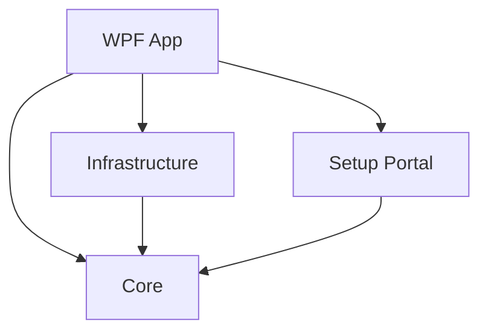

# PRODUCT REQUIREMENTS DOCUMENT (PRD)

# Al Ikhsan Media (Drone Version)

> Status: Implementation-ready specification  
> Target release: v1.0 Local Edition  
> Target platform: Windows 10/11 x64  
> Primary operator: operator live streaming vMix  
> Primary source: DJI Fly pada Android dengan remote DJI yang memakai HP  
> Document language: Bahasa Indonesia  
> Product identity: **Al Ikhsan Media (Drone Version)**

---

## 0. Instruksi wajib untuk Codex VSCode

Dokumen ini adalah sumber kebenaran implementasi. Baca seluruh dokumen sebelum menulis kode.

Gunakan reasoning mendalam. Jangan menghasilkan demo kosmetik, placeholder, mock yang tersambung ke UI produksi, atau implementasi yang sekadar terlihat jadi. Hasil yang diminta adalah aplikasi Windows yang benar-benar dapat menerima stream RTMP dari DJI Fly dan memberikan URL RTSP yang dapat dibuka vMix.

Aturan kerja:

1. Mulai dengan menginspeksi repository dan lingkungan build. Jangan menimpa file pengguna yang sudah ada.
2. Bila repository masih kosong, buat struktur solution sesuai bagian arsitektur dalam PRD ini.
3. Sebelum coding, tulis rencana implementasi berbasis fase dan dependency graph di `docs/IMPLEMENTATION_PLAN.md`.
4. Kerjakan fase secara berurutan. Jangan melompat ke polish UI sebelum jalur media end-to-end terbukti.
5. Setelah setiap fase, jalankan build, unit test, integration test yang relevan, lalu perbarui checklist pada implementation plan.
6. Jangan mengklaim fitur selesai jika hanya mock atau belum diuji pada jalur nyata.
7. Jangan meninggalkan `TODO`, `FIXME`, tombol mati, handler kosong, data palsu, atau exception yang sengaja ditelan pada scope v1.0.
8. Semua error yang menghadap operator harus berbahasa Indonesia, menjelaskan penyebab, dan memberi tindakan berikutnya.
9. Jangan menambahkan login, aktivasi, subscription, telemetry, iklan, cloud wajib, atau mekanisme lisensi perangkat.
10. Jangan menyalin source code, asset, merek, teks, layout unik, atau binary AeroStream. Implementasi harus independen berdasarkan protokol standar dan dokumentasi resmi.
11. Pin seluruh dependency dan binary pihak ketiga ke versi tertentu. Jangan mengunduh artifact `latest` saat runtime.
12. Jangan menjalankan binary hasil download sebelum checksum diverifikasi pada proses build/vendor.
13. Jangan melakukan `git push`, membuat release publik, atau memasukkan credential tanpa instruksi eksplisit pemilik proyek.
14. Bila keputusan kecil belum ditentukan, pilih opsi paling sederhana dan aman yang konsisten dengan PRD, dokumentasikan pada `docs/DECISIONS.md`, lalu lanjutkan.
15. Bila ada konflik antara UI cantik dan reliabilitas stream, reliabilitas stream selalu menang.

Definition of honest completion:

- `dotnet build` sukses tanpa warning yang tidak dijelaskan.
- Seluruh automated test wajib lulus.
- Media engine sungguhan dijalankan, bukan dipalsukan.
- RTMP test publisher berhasil masuk.
- RTSP hasil aplikasi berhasil dibaca player uji dan vMix pada uji manual.
- Kondisi port conflict, firewall, salah jaringan, engine crash, dan stream putus menampilkan recovery yang benar.
- Installer bersih berhasil install, launch, upgrade, dan uninstall pada mesin uji Windows.

---

## 1. Ringkasan produk

**Al Ikhsan Media (Drone Version)** adalah aplikasi receiver dan bridge video lokal untuk operator acara. Aplikasi menerima video live dari DJI Fly melalui RTMP di jaringan Wi-Fi lokal, memantau status stream, dan menyediakan output RTSP yang langsung dapat dimasukkan ke vMix.

Produk ini menyelesaikan masalah remote DJI berbasis HP yang tidak mempunyai HDMI output. HP operator tetap memakai DJI Fly sebagai pengendali dan pengirim video; aplikasi Windows menggantikan kebutuhan hardware HDMI capture untuk jalur video drone.

Versi pertama sengaja local-first:

- Tidak membutuhkan Android companion app.
- Tidak membutuhkan akun.
- Tidak membutuhkan internet setelah instalasi.
- Tidak membutuhkan VPS.
- Tidak mempunyai aktivasi, subscription, trial, atau lisensi berbayar.
- Seluruh fungsi Local Edition v1.0 dapat dipakai 100% gratis untuk konsumsi pribadi.
- Tidak memproses video di cloud.
- Dapat dipakai untuk maksimal enam sumber RTMP lokal, walaupun use case utama adalah satu drone.

### 1.1 Nilai inti

Operator cukup melakukan lima tindakan:

1. Buka aplikasi Windows.
2. Pilih jaringan yang dipakai drone/HP.
3. Scan QR dengan HP dan salin URL RTMP.
4. Tempel URL itu ke menu RTMP DJI Fly.
5. Salin URL vMix dari aplikasi dan tambahkan sebagai Stream/RTSP Input.

Semua kompleksitas port, alamat IP, media engine, monitoring, dan recovery berada di balik UI.

### 1.2 Kebijakan gratis dan tanpa aktivasi

Kebijakan ini dikunci untuk Local Edition v1.0:

- aplikasi milik Al Ikhsan Media dan dipakai untuk konsumsi pribadi/internal;
- harga aplikasi: Rp0;
- tidak ada license key, Device ID, serial number, trial expiry, activation server, login, subscription, pembayaran, iklan, atau feature lock;
- tidak ada fitur inti yang terkunci di balik paket Pro/Premium;
- aplikasi tetap berfungsi penuh ketika laptop tidak mempunyai akses internet;
- proses build dan aplikasi runtime tidak bergantung pada API berbayar;
- seluruh komponen produksi harus memakai dependency yang gratis digunakan sesuai lisensinya;
- apabila suatu dependency baru membutuhkan pembayaran, dependency tersebut harus ditolak atau diganti sebelum digabungkan;
- developer tidak boleh menambahkan mekanisme monetisasi tanpa perubahan PRD dan persetujuan eksplisit pemilik.

Lisensi open-source seperti MIT tetap harus dipatuhi dan notice tetap disertakan. “100% gratis” berarti tidak ada biaya pemakaian aplikasi, bukan menghapus ketentuan hukum dependency. Untuk penggunaan lokal v1.0, router/Wi-Fi yang sudah dimiliki cukup; biaya internet, VPS, domain, atau server cloud tidak diperlukan.

### 1.3 Bukan bagian dari produk

Aplikasi ini bukan:

- pengganti DJI Fly;
- aplikasi kendali penerbangan;
- video mixer seperti vMix/OBS;
- platform livestream tujuan akhir seperti YouTube;
- alat untuk menghilangkan OSD bila DJI Fly memang mengirim OSD;
- jaminan kualitas jaringan venue;
- salinan atau modifikasi AeroStream.

---

## 2. Latar belakang dan masalah

Remote DJI yang memakai HP umumnya tidak menyediakan HDMI out. Kamera drone terlihat di DJI Fly, tetapi vMix di laptop tidak menerima sinyal tersebut secara langsung. Screen mirroring menambah UI DJI Fly, notifikasi, beban HP, dan titik kegagalan. Solusi berbasis RTMP lebih cocok karena DJI Fly sendiri dapat menjadi publisher.

Hambatan operator nonteknis saat memakai server media generik:

- Tidak tahu IP laptop yang benar.
- Bingung membedakan RTMP input dan RTSP output.
- Tidak tahu port mana yang harus dibuka.
- Tidak tahu apakah stream benar-benar masuk.
- Sulit memindahkan URL panjang dari laptop ke HP.
- Tidak dapat membedakan kegagalan jaringan, firewall, port, atau DJI Fly.
- Server media command-line tidak memberikan alur khusus vMix.

Produk harus mengubah masalah teknis itu menjadi alur operator yang jelas dan dapat didiagnosis.

---

## 3. Sasaran, non-sasaran, dan metrik keberhasilan

### 3.1 Sasaran v1.0

1. Menerima RTMP push dari DJI Fly melalui LAN.
2. Mengeluarkan stream yang sama sebagai RTSP untuk vMix tanpa transcoding.
3. Menampilkan status Waiting, Connecting, Live, Stale, dan Error secara benar.
4. Membantu operator memilih IP LAN yang tepat.
5. Menyediakan onboarding end-to-end dalam Bahasa Indonesia.
6. Menyediakan setup portal lokal/QR agar URL dapat disalin dari HP.
7. Mendukung hingga enam slot stream independen.
8. Menyediakan self-diagnostic dan support bundle yang aman.
9. Beroperasi offline setelah instalasi.
10. Dapat dipasang dan dihapus dengan bersih pada Windows 10/11 x64.
11. Menghasilkan clean feed sejauh sumber RTMP DJI Fly memang clean, tanpa menambahkan UI aplikasi, cursor, notifikasi, watermark, logo, lower-third, atau overlay apa pun ke video.
12. Menyediakan panduan cepat yang dapat dipahami tanpa membaca dokumentasi teknis.

### 3.2 Non-sasaran v1.0

- Relay melalui internet, VPS, atau tunnel otomatis.
- Transcoding resolusi/codec.
- Multiview composition.
- Android sender buatan sendiri.
- iOS app.
- Remote flight control.
- Streaming langsung ke YouTube/Facebook dari aplikasi.
- Account management, billing, aktivasi, telemetry, atau update paksa.
- Recording production-grade. Recording dapat masuk v1.1 setelah jalur utama stabil.
- Auto-add input vMix melalui API yang belum diverifikasi. v1.0 cukup memberi URL dan instruksi presisi.

### 3.3 Metrik produk

| Metrik | Target v1.0 |
|---|---:|
| Waktu dari app dibuka hingga siap menerima RTMP | ≤ 5 detik pada laptop target |
| Waktu perubahan status setelah publisher aktif/putus | ≤ 2 detik |
| Langkah operator dari launch sampai URL siap ditempel | ≤ 3 tindakan di desktop |
| Kegagalan yang menghasilkan pesan generik tanpa solusi | 0 pada failure matrix wajib |
| Stream 1080p30 satu sumber tanpa transcoding | stabil ≥ 2 jam |
| Crash selama soak test satu stream 2 jam | 0 |
| Penggunaan CPU app + bridge, tanpa preview decode | target < 8% pada laptop target |
| Penggunaan RAM, satu preview | target < 400 MB |
| Telemetry/network call ke internet saat runtime | 0 |

Metrik CPU/RAM adalah target engineering, bukan alasan mengorbankan kebenaran status atau keamanan.

---

## 4. Persona dan konteks penggunaan

### 4.1 Persona utama: operator vMix acara

- Menjalankan vMix, audio, camera switching, recording, dan stream.
- Paham dasar input vMix, tetapi tidak harus paham media server.
- Menggunakan laptop Windows di lokasi acara.
- Membutuhkan keputusan cepat; tidak sempat membaca log teknis saat live.
- Sering memakai router venue, router sendiri, atau hotspot.

### 4.2 Kondisi lapangan

- Jaringan bisa 2.4 GHz atau 5 GHz.
- Laptop dapat mempunyai Ethernet, Wi-Fi, VPN, Hyper-V, WSL, dan adapter virtual sekaligus.
- Windows Firewall bisa menolak inbound traffic.
- Venue Wi-Fi dapat memakai AP isolation sehingga HP tidak bisa mengakses laptop.
- IP laptop dapat berubah setelah reconnect.
- Operator bisa salah menempel URL output ke DJI Fly atau URL input ke vMix.
- DJI Fly dapat berhenti push ketika sinyal, aplikasi, atau HP bermasalah.
- vMix dan aplikasi berjalan di laptop yang sama.

---

## 5. Topologi sistem



### 5.1 Jalur data utama

- Ingest: `rtmp://<IP-LAPTOP>:1935/<stream-key>`
- vMix output: `rtsp://127.0.0.1:8554/<stream-key>`
- Preview lokal: WebRTC dari loopback melalui media engine.
- Setup portal HP: `http://<IP-LAPTOP>:8877/s/<setup-token>`
- API dan metrics media engine: hanya bind ke loopback, tidak boleh terekspos ke LAN.

### 5.2 Prinsip jaringan

1. Hanya port yang perlu diakses HP yang bind ke LAN.
2. RTSP untuk vMix default bind ke `127.0.0.1` karena vMix berada pada PC yang sama.
3. Management API dan metrics selalu loopback-only.
4. Setup portal hanya menampilkan data setup minimum dan tidak mempunyai kontrol administratif.
5. Tidak ada koneksi internet tersembunyi.

---

## 6. Keputusan arsitektur yang dikunci

### 6.1 Stack utama

| Area | Keputusan |
|---|---|
| Desktop | .NET 8 LTS, WPF x64 |
| Pattern UI | MVVM; CommunityToolkit.Mvvm boleh digunakan |
| Host/DI/config | `Microsoft.Extensions.Hosting` dan options pattern |
| Media engine | MediaMTX binary yang dipin dan dibundel |
| Preview | WebView2 + WebRTC player lokal; muted by default |
| Setup portal | ASP.NET Core Kestrel embedded, minimal endpoints |
| Logging | Serilog structured rolling file; data sensitif di-redact |
| QR | Library QR berlisensi permisif, versi dipin |
| Tests | xUnit + FluentAssertions atau assertion library minimal |
| Installer | Inno Setup per-machine/per-user strategy yang didokumentasikan |
| CI | GitHub Actions Windows runner: restore, build, test, package, checksum |

Alasan memakai WPF/.NET:

- integrasi Windows, process lifecycle, firewall, network adapter, DPAPI, dan installer lebih langsung;
- mudah menghasilkan aplikasi native yang stabil untuk laptop vMix;
- tidak membawa runtime browser besar seperti Electron; WebView2 hanya untuk panel preview;
- cocok untuk long-running operator tool.

### 6.2 Media engine

MediaMTX digunakan sebagai dependency pihak ketiga melalui adapter internal. UI tidak boleh memanggil endpoint MediaMTX langsung.

Tanggung jawab adapter:

- menghasilkan konfigurasi runtime;
- memulai dan menghentikan child process;
- menangkap stdout/stderr;
- health check;
- membaca status path/stream;
- mengubah metadata engine menjadi domain model aplikasi;
- restart terbatas ketika crash;
- memastikan process tidak tertinggal setelah aplikasi keluar.

Tidak ada transcoding pada v1.0. Jalur RTMP ke RTSP harus remux/relay saja agar latency dan CPU rendah.

### 6.3 Dependency dan lisensi

`MediaMTX` berlisensi MIT. Semua dependency wajib diperiksa ulang pada saat implementasi. Buat:

- `THIRD_PARTY_NOTICES.md`;
- `eng/versions.json` berisi versi, URL sumber resmi, SHA-256, license, dan tanggal review;
- script vendor yang idempotent dan memverifikasi hash;
- halaman About yang menampilkan versi aplikasi dan third-party notices.

“Tanpa lisensi” pada produk berarti operator tidak perlu membeli/aktivasi lisensi aplikasi. Ini tidak berarti menghapus notice atau kewajiban lisensi open-source.

### 6.4 Tidak ada Android app pada v1.0

DJI Fly sudah berfungsi sebagai RTMP publisher. Membuat Android app tambahan akan menambah panas, konsumsi baterai, izin screen capture, dan kompleksitas. Setup portal mobile adalah halaman lokal ringan, bukan aplikasi yang perlu diinstal.

---

## 7. Information architecture dan layar

### 7.1 Layar utama

Navigasi desktop hanya mempunyai empat tujuan:

1. **Dashboard** — status engine, jaringan, dan enam slot.
2. **Panduan Setup** — wizard DJI Fly sampai vMix.
3. **Diagnostik** — health checks, port, firewall, konektivitas.
4. **Pengaturan** — network adapter, port advanced, startup, log, About.

Hindari sidebar besar jika empat tab horizontal lebih jelas pada lebar minimum. Keputusan final ditentukan dari prototipe; jangan membuat navigasi ganda.

### 7.2 Dashboard

Header minimum:

- Logo monogram Al Ikhsan Media yang disediakan pemilik; gunakan placeholder teks sederhana bila asset belum ada, bukan logo AI-generated.
- Nama: `Al Ikhsan Media`.
- Sub-label: `Drone Version`.
- Engine health: `Siap`, `Perlu tindakan`, atau `Berhenti`.
- Network chip: nama adapter + IPv4 aktif.
- Tombol `Buka Panduan`.

Area slot menggunakan list/grid responsif maksimal dua kolom, bukan enam kartu sempit.

Setiap stream card wajib memiliki:

- nama editable: Drone 1 sampai Drone 6;
- status dengan teks dan warna, bukan warna saja;
- preview 16:9 saat Live;
- RTMP address untuk DJI Fly;
- tombol `Tampilkan di HP`;
- RTSP address untuk vMix;
- tombol `Salin URL vMix`;
- metadata: uptime, bitrate estimasi, codec bila tersedia, jumlah reader;
- action menu: rename, regenerate secure key, reset slot;
- last error/recovery hint ketika gagal.

Jangan tampilkan enam preview aktif sekaligus secara default karena memboroskan decode. Kebijakan preview:

- hanya preview card yang dipilih yang memutar video;
- card lain menampilkan poster/status;
- maksimal satu preview decode pada v1.0;
- preview selalu muted saat mulai;
- audio dapat diaktifkan eksplisit dan harus dimatikan ketika card kehilangan fokus atau app minimize, kecuali user memilih keep audio.

### 7.3 Empty/waiting state

Waiting state bukan error. Tampilkan:

`Menunggu video dari DJI Fly`

Dengan instruksi singkat:

1. HP dan laptop pada Wi-Fi yang sama.
2. Buka DJI Fly → Live Streaming Platforms → RTMP.
3. Gunakan URL yang ditampilkan.

### 7.4 Setup wizard

Wizard harus dapat dibuka ulang kapan pun dan tidak memblokir dashboard.

#### Langkah 1 — Pilih jaringan

- Tampilkan adapter yang layak beserta IPv4 dan tipe.
- Rekomendasikan adapter dengan default gateway dan koneksi aktif.
- Tandai VPN/virtual adapter sebagai `Tidak direkomendasikan`.
- Jika ada lebih dari satu kandidat kuat, jangan memilih diam-diam; tampilkan rekomendasi dan alasan.
- Tampilkan pesan jika Windows network profile adalah Public.

#### Langkah 2 — Izinkan akses lokal

- Jalankan tes bind port.
- Periksa firewall rule milik aplikasi.
- Tombol `Perbaiki Firewall` memicu elevation hanya untuk rule yang dibutuhkan.
- Scope rule ke executable/port, TCP, dan profile Private. Jangan membuka `Any program / Any port`.
- Jika user menolak UAC, tampilkan instruksi manual dan tetap izinkan Retry.

#### Langkah 3 — Pindahkan URL ke HP

- Tampilkan QR ke setup portal lokal.
- Tampilkan URL portal untuk diketik manual.
- Tampilkan RTMP URL besar sebagai fallback.
- Beri label jelas: `Tempel URL ini di DJI Fly, bukan di vMix`.

#### Langkah 4 — Tunggu video

- Status real-time.
- Timeout tidak boleh dianggap crash.
- Setelah 20 detik tanpa publisher, tampilkan troubleshooting kontekstual.
- Setelah stream masuk, otomatis lanjut atau tampilkan CTA `Lanjut ke vMix`.

#### Langkah 5 — Tambahkan ke vMix

- Tampilkan RTSP URL loopback.
- Instruksi: `vMix → Add Input → Stream / SRT → Stream Type: RTSP over TCP → URL`.
- Jangan memerintah user memilih opsi yang tidak diverifikasi pada versi vMix target.
- Tombol `Salin URL vMix`.
- Tombol `Tes Output` menjalankan health probe non-destructive, bukan membuka reader permanen.

### 7.5 Diagnostik

Diagnostik menjalankan pemeriksaan berurutan dengan hasil `Lulus`, `Peringatan`, `Gagal`, `Belum diuji`:

1. Media engine binary ada dan hash sesuai.
2. Media engine process sehat.
3. Port RTMP dapat bind/listen.
4. Port RTSP loopback dapat bind/listen.
5. Setup portal dapat listen pada adapter terpilih.
6. Firewall rule sesuai.
7. Adapter dan IPv4 masih aktif.
8. Network profile bukan Public atau user sudah diberi warning.
9. Publisher aktif/tidak aktif.
10. RTSP output dapat dibaca saat publisher aktif.
11. Konflik VPN/virtual adapter terdeteksi.
12. Disk space cukup untuk log/support bundle.

Setiap hasil gagal mempunyai:

- apa yang gagal;
- kemungkinan penyebab;
- tombol perbaikan bila aman;
- langkah manual;
- detail teknis collapsible.

### 7.6 Pengaturan

Pengaturan dasar:

- adapter jaringan: Automatic atau adapter tertentu;
- jumlah slot aktif: 1–6, default 1;
- start media engine otomatis: on;
- minimize to tray: on;
- close behavior: selalu tanya bila ada stream Live;
- bahasa: Indonesia untuk v1.0;
- preview: on/off;
- launch at Windows startup: off;
- log retention: 7 hari default, pilihan 3/7/14;
- reset onboarding.

Advanced settings disembunyikan di bagian collapsible:

- RTMP port default 1935;
- RTSP port default 8554;
- setup portal port default 8877;
- WebRTC preview port sesuai engine pin;
- bind address override;
- TCP transport preference untuk RTSP;
- export/import settings non-secret.

Perubahan port wajib divalidasi, dideteksi konflik, dan memerlukan restart engine yang dipandu.

### 7.7 Panduan cepat dalam aplikasi

Dashboard wajib mempunyai tombol `Cara Pakai Singkat` yang membuka panduan ringkas tanpa meninggalkan aplikasi. Panduan harus muat dalam satu layar desktop atau maksimal satu halaman cetak; detail teknis dipindahkan ke troubleshooting.

Copy final panduan cepat:

#### Cara memakai drone di vMix

1. **Sambungkan perangkat**  
   Hubungkan laptop dan HP remote DJI ke router/Wi-Fi yang sama. Bila memungkinkan, sambungkan laptop ke router memakai kabel LAN.

2. **Siapkan penerima**  
   Buka Al Ikhsan Media (Drone Version). Tunggu tulisan `Siap menerima video`, lalu pilih `Drone 1`.

3. **Kirim dari DJI Fly**  
   Tekan `Tampilkan di HP`, scan QR, dan salin URL RTMP. Di DJI Fly buka menu Live Streaming/Custom RTMP, tempel URL tersebut, lalu mulai siaran.

4. **Pastikan video masuk**  
   Kembali ke aplikasi. Tunggu status berubah hijau menjadi `Video masuk` dan periksa preview. Jangan lanjut bila status masih `Menunggu video`.

5. **Masukkan ke vMix**  
   Tekan `Salin URL vMix`. Di vMix pilih `Add Input → Stream / SRT`, pilih RTSP/RTSP over TCP bila tersedia, tempel URL, lalu tekan OK.

6. **Gunakan saat acara**  
   Perlakukan input drone seperti input kamera biasa di vMix. Biarkan aplikasi Al Ikhsan Media tetap berjalan/minimize selama acara.

Kotak bantuan di bawah panduan hanya memuat tiga masalah paling umum:

- **Status tetap menunggu:** cek RTMP sudah dimulai di DJI Fly dan URL tidak salah.
- **HP tidak bisa membuka QR:** pastikan HP dan laptop satu jaringan; gunakan router sendiri bila Wi-Fi venue mengisolasi perangkat.
- **vMix tidak menampilkan video:** pastikan status aplikasi sudah `Video masuk`, lalu copy ulang URL vMix.

Panduan dilarang memakai istilah media server, publisher, path, remux, codec negotiation, atau API. Tautan `Buka troubleshooting lengkap` tersedia untuk kasus lanjutan.

---

## 8. Design system dan standar visual

UI harus terasa seperti alat broadcast profesional, tenang, dan mudah dibaca di ruang acara. Jangan memakai gaya dashboard template generik.

### 8.1 Arah visual

- Tema utama: dark professional.
- Background: charcoal/obsidian, bukan hitam murni.
- Primary/accent: hijau emerald Al Ikhsan.
- Secondary accent terbatas: gold hangat untuk identitas, bukan untuk semua CTA.
- Success/warning/error tetap mengikuti semantik dan kontras WCAG.
- Tidak ada gradient dekoratif, glassmorphism, neon glow, blob, ilustrasi 3D, atau icon acak.
- Border tipis dan elevation rendah; struktur berasal dari spacing dan hierarchy.

### 8.2 Token awal

| Token | Nilai awal | Penggunaan |
|---|---|---|
| `Surface.App` | `#111513` | latar aplikasi |
| `Surface.Panel` | `#181E1B` | panel utama |
| `Surface.Raised` | `#202823` | control/card aktif |
| `Border.Default` | `#344039` | separator/border |
| `Text.Primary` | `#F4F7F5` | teks utama |
| `Text.Secondary` | `#AEBAB3` | metadata |
| `Brand.Emerald` | `#1F9D68` | primary action |
| `Brand.Gold` | `#C7A35B` | aksen identitas terbatas |
| `Status.Warning` | `#E7A83E` | warning |
| `Status.Error` | `#E05A5A` | error |
| `Status.Info` | `#4B91E2` | info |

Token adalah titik awal. Verifikasi contrast ratio. Bila gagal WCAG AA, ubah nilai sebelum implementasi final dan catat keputusan.

### 8.3 Typography dan spacing

- Font: Segoe UI Variable bila tersedia, fallback Segoe UI.
- Base font 14 px efektif; body kritis minimal 15–16 px.
- URL memakai monospace system dan dapat dipilih.
- Spacing scale: 4, 8, 12, 16, 24, 32.
- Radius: 6 untuk control, 8 untuk panel; jangan memakai pill pada semua elemen.
- Target klik minimal 36×36 px desktop.
- Window minimum: 1100×700; layout harus tetap usable.

### 8.4 Accessibility

- Semua status mempunyai icon + teks, tidak hanya warna.
- Tab order logis.
- Keyboard navigation untuk action penting.
- Screen-reader labels pada icon buttons.
- Focus ring terlihat.
- Copy feedback berbunyi `URL berhasil disalin` dan tersedia secara visual.
- Preview tidak autoplay audio.
- Animasi status singkat dan dapat dipahami; tidak ada infinite shimmer.

---

## 9. Functional requirements

Format ID wajib dipertahankan dalam issue, test, dan release checklist.

### 9.1 Application lifecycle

#### FR-APP-001 — Single instance

Hanya satu instance aplikasi boleh berjalan per user session. Instance kedua mengaktifkan window instance pertama dan keluar bersih. Jangan membunuh process sembarang berdasarkan nama.

#### FR-APP-002 — Startup orchestration

Saat launch:

1. load dan migrate settings;
2. verifikasi dependency manifest dan media binary;
3. pilih/validasi network adapter;
4. periksa port;
5. generate runtime config atomically;
6. start engine;
7. health check;
8. start setup portal;
9. tampilkan Dashboard.

UI boleh muncul dengan splash singkat, tetapi harus memberikan state nyata. Jika startup gagal, tampilkan recovery screen; jangan hanya menutup aplikasi.

#### FR-APP-003 — Safe shutdown

Jika tidak ada live stream, app menghentikan portal dan engine secara graceful, menunggu timeout, lalu kill hanya child process yang memang dimiliki app.

Jika stream Live:

- tampilkan dialog: `Video drone masih aktif`;
- pilihan `Tetap jalankan di tray`, `Hentikan dan keluar`, `Batal`;
- default focus `Batal` untuk mencegah salah klik.

#### FR-APP-004 — Crash recovery

Media engine yang exit tak terduga direstart maksimal 3 kali dengan backoff 1s, 3s, 10s. Setelah itu masuk state `Perlu tindakan` dan meminta operator membuka Diagnostik. Counter reset setelah engine stabil 5 menit.

App crash tidak boleh menyebabkan engine orphan. Gunakan Job Object Windows atau parent-process ownership mechanism yang teruji.

#### FR-APP-005 — Sleep/resume

Pada resume:

- re-enumerate adapter/IP;
- validate ports;
- restart engine bila health check gagal;
- perbarui URL jika IP berubah;
- beri warning bahwa URL DJI Fly perlu diperbarui.

### 9.2 Network discovery

#### FR-NET-001 — Adapter enumeration

Enumerasi adapter IPv4 `OperationalStatus.Up`. Abaikan loopback. Klasifikasikan physical Ethernet/Wi-Fi, hotspot, VPN, virtual, Hyper-V, WSL, Docker, dan unknown.

#### FR-NET-002 — Recommendation scoring

Rekomendasi adapter harus deterministik. Contoh bobot awal:

- +40 mempunyai default IPv4 gateway;
- +30 physical Wi-Fi/Ethernet;
- +20 network profile Private;
- +10 DHCP/address valid;
- -50 VPN/tunnel;
- -40 virtual/Hyper-V/WSL/Docker;
- -30 APIPA `169.254.0.0/16`;
- -20 disconnected gateway/unreachable.

Jangan hanya mengambil `first IPv4`.

#### FR-NET-003 — IP change detection

Subscribe network change event dan lakukan debounce. Ketika IP adapter terpilih berubah:

- regenerate displayed URL;
- restart/rebind portal/engine bila dibutuhkan;
- tandai stream setup stale;
- tampilkan banner non-dismissable sampai user acknowledge.

#### FR-NET-004 — AP isolation guidance

Jika portal tidak dapat diakses dari HP tetapi local checks lulus, diagnostik harus menyebut kemungkinan AP/client isolation dan menyarankan router/hotspot pribadi. Jangan mengklaim dapat mendeteksi AP isolation secara pasti dari laptop saja.

### 9.3 Port and firewall

#### FR-PORT-001 — Preflight

Periksa port sebelum start dan identifikasi owner process bila izin memungkinkan. Pesan contoh:

`Port 1935 sedang dipakai oleh <process>. Tutup aplikasi tersebut atau pilih port lain.`

Jangan otomatis mematikan process lain.

#### FR-PORT-002 — Port fallback

Jangan mengganti port diam-diam. Berikan dua pilihan:

- `Coba lagi setelah menutup aplikasi lain`;
- `Gunakan port lain` lalu pilih port yang bebas dan perbarui URL.

#### FR-FW-001 — Firewall repair

Rule dibuat dengan nama stabil dan versi schema, misalnya:

- `Al Ikhsan Media Drone - RTMP In`;
- `Al Ikhsan Media Drone - Setup Portal`.

Hanya TCP port yang dibutuhkan, profile Private. Store identifier agar uninstall/repair dapat membersihkan rule milik app tanpa menyentuh rule lain.

#### FR-FW-002 — Public network

Pada profile Public, jangan otomatis membuka inbound tanpa peringatan eksplisit. Rekomendasikan mengganti jaringan ke Private atau menggunakan router sendiri.

### 9.4 Stream slots

#### FR-STR-001 — Slot identity

Maksimal enam slot. Masing-masing mempunyai immutable UUID internal dan editable display name. URL path tidak bergantung langsung pada display name agar rename tidak memutus stream.

#### FR-STR-002 — Secure stream key

Setiap slot mempunyai random URL-safe key minimal 128-bit entropy. Key dibuat saat slot pertama kali aktif dan disimpan terenkripsi dengan Windows DPAPI CurrentUser.

Contoh path yang ditampilkan boleh ramah dibaca:

`drone1-k7m2q9x4`

Jangan log full key. Log hanya prefix pendek yang tidak cukup untuk rekonstruksi.

#### FR-STR-003 — Regenerate key

Regenerate harus meminta konfirmasi karena memutus publisher dan mengubah kedua URL. Setelah regenerate, config engine di-update secara aman dan UI menunjukkan bahwa DJI Fly/vMix harus memakai URL baru.

#### FR-STR-004 — Publisher exclusivity

Satu slot menerima satu publisher aktif. Bila publisher kedua mencoba path sama, tolak secara deterministik dan log event. Jangan mengganti publisher pertama diam-diam saat live.

#### FR-STR-005 — Stream state machine



Definisi:

- `Disabled`: slot tidak dikonfigurasi/listen.
- `Waiting`: engine sehat, belum ada publisher.
- `Connecting`: session muncul tetapi track belum ready.
- `Live`: track ready dan byte counter bertambah.
- `Stale`: track masih terdaftar tetapi byte counter tidak bertambah melewati threshold.
- `Error`: kegagalan spesifik yang memerlukan tindakan atau retry.

Threshold awal:

- polling interval 1 detik;
- Stale setelah tidak ada pertambahan byte 3 detik;
- kembali Waiting setelah stream tidak ready/absent 10 detik.

Nilai harus configurable internal dan diuji; jangan expose ke basic settings.

#### FR-STR-006 — Metadata

Tampilkan jika engine menyediakan data nyata:

- video/audio codec;
- publisher uptime;
- estimated incoming bitrate dari delta byte/time;
- reader count;
- last packet/update time.

Jangan mengarang resolution/FPS bila engine tidak menyediakannya. Field yang tidak ada ditampilkan `Tidak tersedia`, bukan `0`.

#### FR-STR-007 — Output URL

RTSP vMix harus memakai loopback secara default:

`rtsp://127.0.0.1:<rtsp-port>/<stream-key>`

Alasannya ditulis pada tooltip: output ini hanya untuk vMix pada laptop yang sama dan tidak berubah ketika IP Wi-Fi berubah.

#### FR-STR-008 — Disable slot

Slot live tidak boleh dinonaktifkan tanpa konfirmasi. Disable menghapus exposure path dari config/runtime adapter dan menghentikan preview/reader milik app.

### 9.5 Media engine management

#### FR-ENG-001 — Binary integrity

Pada build/package, hash diverifikasi. Pada runtime release build, app membandingkan binary dengan manifest internal sebelum mengeksekusi. Kegagalan integrity menghentikan engine dan menampilkan petunjuk reinstall; jangan download replacement otomatis.

#### FR-ENG-002 — Generated config

Generated configuration ditempatkan di runtime directory user, ditulis ke temp file, divalidasi, lalu atomic replace. Jangan menulis ke Program Files saat runtime.

Baseline binding:

- RTMP: adapter/LAN atau all interfaces sesuai kemampuan engine, dilindungi firewall dan key;
- RTSP: `127.0.0.1`;
- API: `127.0.0.1`;
- metrics: `127.0.0.1`;
- WebRTC preview: `127.0.0.1`;
- setup portal bukan bagian dari MediaMTX.

Syntax config harus mengikuti versi MediaMTX yang dipin. Jangan menyalin contoh lama tanpa integration test.

#### FR-ENG-003 — Health contract

Adapter engine mengembalikan domain object, bukan JSON mentah:

```csharp
public sealed record MediaEngineHealth(
    EngineState State,
    string Version,
    DateTimeOffset StartedAt,
    int RestartCount,
    string? OperatorMessage,
    string? DiagnosticCode);
```

#### FR-ENG-004 — Version adapter

Semua parsing API MediaMTX berada di assembly Infrastructure dengan fixture contract test. UI/Core tidak mengetahui endpoint/version schema. Upgrade engine harus dapat diuji dengan mengganti adapter fixture.

#### FR-ENG-005 — Logs

Capture stdout/stderr as structured events dengan bounded channel. Hindari blocking child process karena buffer tidak dibaca. Batasi rate untuk pesan berulang.

### 9.6 Preview

#### FR-PREV-001 — Real preview

Preview hanya tampil bila stream Live. Preview harus berasal dari stream aktual melalui loopback WebRTC, bukan gambar/video dummy.

#### FR-PREV-002 — Isolation

WebView2 hanya boleh navigasi ke origin loopback yang dihasilkan app. Blok external navigation, popup, download, devtools pada release build, dan permission yang tidak diperlukan.

#### FR-PREV-003 — Failure independence

Kegagalan preview tidak boleh menghentikan RTMP→RTSP bridge. Tampilkan `Preview tidak tersedia; output vMix tetap berjalan` jika output sehat.

#### FR-PREV-004 — Resource control

Maksimal satu active preview. Dispose/reuse WebView secara benar. Uji perpindahan antarslot 100 kali tanpa pertumbuhan memori tak terbatas.

### 9.7 Setup portal mobile

#### FR-WEB-001 — Purpose

Portal hanya membantu memindahkan URL dari desktop ke HP. Tidak mengontrol engine atau settings.

#### FR-WEB-002 — Access token

QR mengarah ke URL dengan setup token random yang berbeda dari stream key. Token:

- berlaku 10 menit;
- hanya untuk satu slot;
- dapat di-regenerate;
- tidak disimpan di log;
- invalid setelah app restart atau manual revoke.

#### FR-WEB-003 — Mobile UI

Halaman harus ringan, responsive, dan dapat dipakai offline. Isi:

- branding Al Ikhsan Media (Drone Version);
- nama slot;
- RTMP URL masked sebagian, dengan tombol `Tampilkan`;
- tombol `Salin URL RTMP`;
- empat langkah menuju menu RTMP DJI Fly;
- indikator apakah laptop masih dapat dijangkau;
- warning: `Jangan bagikan URL ini ke orang lain`.

Tidak ada CDN, analytics, external font, cookie, service worker, atau asset remote.

#### FR-WEB-004 — Headers and exposure

- `Cache-Control: no-store`;
- CSP ketat;
- `X-Content-Type-Options: nosniff`;
- no directory listing;
- rate limit sederhana;
- response generik untuk token invalid;
- bind hanya pada adapter yang dipilih jika dapat dilakukan dengan stabil.

#### FR-WEB-005 — Clipboard fallback

Jika Clipboard API gagal karena HTTP/non-secure context, gunakan selectable text dan instruksi press-and-hold. Jangan menampilkan toast sukses bila copy sebenarnya gagal.

### 9.8 Clean video feed

#### FR-CLN-001 — Direct camera path

Jalur produksi wajib memakai stream RTMP langsung yang dihasilkan DJI Fly. Dilarang memakai screen capture, screen mirroring, desktop capture, scrcpy, capture window, atau perekaman layar sebagai jalur default. Tujuannya agar cursor, status bar HP, tombol DJI Fly, notifikasi Android, dan UI aplikasi Windows tidak ikut masuk ke output vMix.

#### FR-CLN-002 — No application overlay

Al Ikhsan Media (Drone Version) tidak boleh menambahkan apa pun ke frame video:

- tidak ada watermark;
- tidak ada logo Al Ikhsan Media;
- tidak ada nama aplikasi;
- tidak ada tally graphic;
- tidak ada timestamp;
- tidak ada lower-third;
- tidak ada border;
- tidak ada status teknis;
- tidak ada iklan.

Branding hanya boleh berada di UI aplikasi, setup portal, installer, dan dokumentasi—tidak di video output.

#### FR-CLN-003 — Remux-only integrity

Pada v1.0, media engine hanya melakukan relay/remux. App tidak boleh decode–re-encode, crop, scale, sharpen, denoise, recolor, atau mengubah frame. Codec payload dari sumber dipertahankan sejauh protokol output memungkinkan. Hal ini mengurangi latency, CPU, dan risiko penurunan kualitas.

#### FR-CLN-004 — Source limitation

Definisi clean feed yang dapat dijamin produk:

`Output aplikasi tidak menambahkan elemen visual yang tidak ada pada input RTMP.`

App tidak boleh menjanjikan dapat menghapus OSD, telemetry, watermark, atau graphic yang sudah tertanam pada video oleh DJI Fly/firmware sebelum stream mencapai laptop. Menghapus elemen yang sudah baked-in memerlukan pemrosesan/transcoding dan berada di luar v1.0.

#### FR-CLN-005 — Hardware clean-feed gate

Sebelum release production-ready, lakukan uji manual dengan kombinasi drone, remote, HP, dan versi DJI Fly milik operator:

1. mulai Custom RTMP dari DJI Fly;
2. buka output RTSP di vMix;
3. rekam sample minimal 60 detik;
4. periksa apakah tombol DJI Fly, status bar Android, cursor, notifikasi, atau UI desktop ikut muncul;
5. simpan screenshot frame dan hasil pada `docs/HARDWARE_VALIDATION.md`;
6. beri hasil `Clean`, `Source contains DJI overlay`, atau `Not verified`.

Release tidak boleh mengklaim `clean feed terverifikasi` sebelum hasilnya `Clean` pada perangkat asli pengguna. Bila sumber memuat overlay DJI, dokumentasi harus jujur menyebutnya sebagai batas sumber, bukan bug bridge.

#### FR-CLN-006 — Clean-feed status in app

Pada halaman About/Panduan tampilkan keterangan ringkas:

`Aplikasi tidak menambahkan watermark atau tampilan layar. Hasil akhir mengikuti video RTMP yang dikirim DJI Fly.`

Jangan menampilkan badge `Clean Feed` berdasarkan asumsi. Badge hanya boleh tampil jika model/konfigurasi tersebut sudah dicatat lulus hardware validation.

### 9.9 vMix handoff

#### FR-VMIX-001 — URL clarity

UI membedakan dua URL dengan judul dan warna semantik:

- `Untuk DJI Fly (Input ke laptop)` — RTMP LAN.
- `Untuk vMix (Output dari laptop)` — RTSP loopback.

#### FR-VMIX-002 — Instructions

Panduan vMix harus version-neutral sejauh mungkin dan menyebut menu berdasarkan dokumentasi resmi. Bila pilihan transport tersedia, rekomendasikan RTSP over TCP untuk stabilitas lokal, kemudian uji terhadap versi vMix target.

#### FR-VMIX-003 — Read test

App menyediakan probe terbatas untuk memastikan RTSP endpoint dapat membuka session ketika stream Live. Probe timeout ≤ 5 detik dan selalu melepas reader.

#### FR-VMIX-004 — Future API integration boundary

Definisikan interface `IVmixIntegrationService`, tetapi implementasi v1.0 hanya `CopyUrl` dan `OpenGuide`. Jangan mengirim HTTP command ke vMix sebelum endpoint dan consent diverifikasi pada fase v1.1.

### 9.10 Notifications and tray

#### FR-NTF-001

Toast internal untuk:

- stream masuk;
- stream putus lebih dari threshold;
- IP berubah;
- engine restart;
- URL copy berhasil/gagal.

Hindari toast berulang saat stream flapping; lakukan debounce dan rate limiting.

#### FR-NTF-002

Tray menu:

- Buka Dashboard;
- status ringkas;
- Buka Diagnostik;
- Keluar.

Tray tooltip tidak boleh memuat stream key.

### 9.11 Settings and persistence

#### FR-CFG-001

Simpan konfigurasi di:

`%LOCALAPPDATA%\AlIkhsanMedia\DroneVersion\`

Subfolder:

- `config`;
- `runtime`;
- `logs`;
- `support`;
- `webview2` bila fixed/user data folder dibutuhkan.

#### FR-CFG-002

Gunakan schema version dan migrasi deterministik. Corrupt config dipindah ke backup bertimestamp, app kembali ke safe defaults, dan user diberi tahu. Jangan silently discard.

#### FR-CFG-003

Stream key dan secret menggunakan DPAPI CurrentUser. Export settings tidak menyertakan secret secara default.

### 9.12 Logs and support bundle

#### FR-SUP-001 — Structured logs

Log memuat timestamp UTC, level, event ID, component, correlation ID, dan safe properties. Dilarang menulis:

- full stream key;
- setup token;
- Windows username/path personal tanpa redaction;
- IP publik;
- isi video/audio;
- clipboard.

#### FR-SUP-002 — Support bundle

Tombol `Buat Paket Diagnostik` membuat ZIP lokal berisi:

- app version/build commit;
- OS version/architecture;
- dependency versions dan hash status;
- sanitized settings;
- adapter summary;
- port/firewall check summary;
- recent redacted logs;
- engine config yang secret-nya di-redact;
- diagnostic results.

Sebelum menyimpan, tampilkan daftar isi dan pernyataan bahwa bundle tetap lokal sampai user membagikannya sendiri.

#### FR-SUP-003 — Retention

Rolling logs maksimum 10 MB per file, maksimal sesuai retention days. Cleanup tidak boleh menyentuh file di luar app data directory.

---

## 10. Non-functional requirements

### 10.1 Reliability

- Seluruh background task menerima cancellation token.
- Tidak ada `async void` kecuali event handler UI yang menangani exception.
- Bounded queue untuk log/event.
- Retry hanya untuk operasi idempotent dan transient.
- UI thread tidak boleh melakukan I/O blocking.
- Engine lifecycle serialized dengan lock/state machine; jangan start/stop paralel.
- Settings write atomic.
- Network events di-debounce.

### 10.2 Security

- Least-privilege; app normal tidak berjalan sebagai administrator.
- Elevation hanya helper/action firewall yang spesifik.
- API/metrics/preview loopback-only.
- Random secret menggunakan cryptographic RNG.
- DPAPI untuk secret at rest.
- Portal token short-lived.
- No remote script/font/CDN.
- Dependency pin + SHA-256.
- Release build signed jika certificate tersedia; proses signing dipisahkan dan tidak memasukkan secret ke repo.
- Threat model ditulis di `docs/THREAT_MODEL.md` menggunakan STRIDE ringan.

### 10.3 Privacy

- Tidak ada telemetry default maupun opt-in pada v1.0.
- Tidak ada account.
- Tidak ada cloud call.
- Semua video tetap lokal kecuali vMix mengirim ke tujuan streaming.
- About/Privacy menjelaskan batas tersebut secara eksplisit.

### 10.4 Performance

- Tidak melakukan transcode.
- UI polling maksimal 1 Hz untuk metadata umum; update UI di-batch.
- Preview satu stream saja.
- Jangan parse log sebagai sumber status utama bila API tersedia.
- Soak test mengukur handle, thread, RAM, CPU, dan child process.

### 10.5 Compatibility

- Windows 10 22H2 x64 dan Windows 11 x64.
- .NET runtime self-contained agar user tidak perlu install runtime manual.
- WebView2 bootstrap/install strategy harus didokumentasikan; fallback tanpa preview tetap menjaga bridge berfungsi.
- Media codecs mengikuti kemampuan MediaMTX/vMix dan stream DJI. App tidak menjanjikan codec yang tidak diuji.

### 10.6 Localization

Walau v1.0 hanya Bahasa Indonesia, seluruh UI string ditempatkan di resource. Tidak ada user-facing string tersebar di ViewModel/service.

### 10.7 Maintainability

- Nullable reference types enabled.
- TreatWarningsAsErrors untuk source project; test project dapat punya pengecualian terdokumentasi.
- EditorConfig dan analyzers.
- Dependency direction enforcement test.
- Domain/Core tidak mereferensi WPF, ASP.NET, MediaMTX DTO, atau Windows API langsung.

---

## 11. Domain model dan contracts

### 11.1 Entitas utama

```csharp
public sealed record StreamSlotId(Guid Value);

public sealed record StreamSlot(
    StreamSlotId Id,
    string DisplayName,
    bool Enabled,
    ProtectedSecret StreamKey,
    StreamRuntimeState Runtime);

public sealed record StreamRuntimeState(
    StreamState State,
    DateTimeOffset? PublisherConnectedAt,
    DateTimeOffset? LastMediaAt,
    long BytesReceived,
    double? EstimatedBitrateKbps,
    IReadOnlyList<string> Codecs,
    int ReaderCount,
    OperatorProblem? Problem);

public sealed record NetworkSelection(
    string AdapterId,
    string FriendlyName,
    IPAddress Address,
    NetworkKind Kind,
    bool IsRecommended,
    IReadOnlyList<string> Warnings);
```

Nama type boleh disempurnakan, tetapi konsep dan separation harus dipertahankan.

### 11.2 Service boundaries

```csharp
public interface IMediaEngineService
{
    Task<StartEngineResult> StartAsync(EngineConfiguration config, CancellationToken ct);
    Task StopAsync(CancellationToken ct);
    Task<MediaEngineHealth> GetHealthAsync(CancellationToken ct);
    Task<IReadOnlyList<EnginePathSnapshot>> GetPathsAsync(CancellationToken ct);
    Task<ProbeResult> ProbeRtspAsync(StreamSlotId slotId, CancellationToken ct);
}

public interface INetworkDiscoveryService
{
    Task<IReadOnlyList<NetworkCandidate>> DiscoverAsync(CancellationToken ct);
    IObservable<NetworkChange> Changes { get; }
}

public interface IFirewallService
{
    Task<FirewallInspection> InspectAsync(AppPortPlan plan, CancellationToken ct);
    Task<FirewallRepairResult> RepairAsync(AppPortPlan plan, CancellationToken ct);
}

public interface ISetupPortalService
{
    Task StartAsync(PortalConfiguration config, CancellationToken ct);
    Task<SetupLink> CreateLinkAsync(StreamSlotId slotId, TimeSpan lifetime, CancellationToken ct);
    Task RevokeAsync(SetupLinkId linkId, CancellationToken ct);
    Task StopAsync(CancellationToken ct);
}

public interface ISupportBundleService
{
    Task<SupportBundlePreview> PreviewAsync(CancellationToken ct);
    Task<SupportBundleResult> CreateAsync(string destination, CancellationToken ct);
}
```

### 11.3 Error taxonomy

Setiap operator-facing problem mempunyai stable diagnostic code:

| Code | Makna | Recovery utama |
|---|---|---|
| `ENG_BINARY_MISSING` | binary engine tidak ada | reinstall |
| `ENG_INTEGRITY_FAILED` | checksum berbeda | reinstall dari paket resmi |
| `ENG_START_FAILED` | process gagal start | detail + diagnostic |
| `ENG_CRASH_LOOP` | restart limit tercapai | diagnostic/restart manual |
| `NET_NO_ADAPTER` | tidak ada adapter layak | connect Wi-Fi/Ethernet |
| `NET_IP_CHANGED` | IP laptop berubah | perbarui URL DJI Fly |
| `NET_PUBLIC_PROFILE` | profile Public | ubah ke Private/router sendiri |
| `NET_POSSIBLE_ISOLATION` | portal tidak reachable dari HP | router/hotspot pribadi |
| `PORT_RTMP_IN_USE` | port RTMP conflict | tutup owner/ganti port |
| `PORT_RTSP_IN_USE` | port RTSP conflict | tutup owner/ganti port |
| `FW_RULE_MISSING` | firewall block mungkin | repair rule |
| `STR_PUBLISH_REJECTED` | publisher ditolak | cek key/duplikasi |
| `STR_STALE` | data berhenti | cek DJI Fly/sinyal/Wi-Fi |
| `PREVIEW_FAILED` | WebRTC preview gagal | output vMix tetap diuji |
| `VMIX_PROBE_FAILED` | RTSP tak dapat dibaca | cek state/codec/engine |

UI tidak menampilkan stack trace. Detail teknis tersedia di Diagnostics dan log.

---

## 12. Configuration model

Contoh konseptual, bukan license untuk mengabaikan migration/versioning:

```json
{
  "schemaVersion": 1,
  "network": {
    "selectionMode": "automatic",
    "adapterId": null
  },
  "ports": {
    "rtmp": 1935,
    "rtsp": 8554,
    "setupPortal": 8877
  },
  "application": {
    "minimizeToTray": true,
    "launchAtStartup": false,
    "previewEnabled": true,
    "logRetentionDays": 7
  },
  "slots": [
    {
      "id": "uuid",
      "displayName": "Drone 1",
      "enabled": true,
      "protectedStreamKey": "dpapi-envelope"
    }
  ]
}
```

Runtime config MediaMTX tidak menjadi source of truth. Source of truth adalah validated application settings; engine config selalu digenerate.

---

## 13. Struktur solution

```text
AlIkhsanMedia.Drone.sln
├─ src/
│  ├─ AlIkhsanMedia.Drone.App/              # WPF, Views, ViewModels, composition root
│  ├─ AlIkhsanMedia.Drone.Core/             # domain, use cases, contracts
│  ├─ AlIkhsanMedia.Drone.Infrastructure/   # MediaMTX, Windows, persistence, logs
│  └─ AlIkhsanMedia.Drone.SetupPortal/      # embedded Kestrel endpoints/static assets
├─ tests/
│  ├─ AlIkhsanMedia.Drone.Core.Tests/
│  ├─ AlIkhsanMedia.Drone.Infrastructure.Tests/
│  ├─ AlIkhsanMedia.Drone.IntegrationTests/
│  └─ AlIkhsanMedia.Drone.Ui.Tests/          # hanya bila tooling stabil
├─ eng/
│  ├─ versions.json
│  ├─ fetch-mediamtx.ps1
│  ├─ verify-vendor.ps1
│  └─ package.ps1
├─ installer/
│  └─ AlIkhsanMediaDrone.iss
├─ assets/
│  ├─ branding/
│  └─ screenshots/
├─ docs/
│  ├─ IMPLEMENTATION_PLAN.md
│  ├─ ARCHITECTURE.md
│  ├─ DECISIONS.md
│  ├─ THREAT_MODEL.md
│  ├─ TEST_PLAN.md
│  ├─ USER_GUIDE.md
│  ├─ TROUBLESHOOTING.md
│  └─ RELEASE_CHECKLIST.md
├─ vendor/
│  └─ mediamtx/                              # artifact pinned atau restored script
├─ .editorconfig
├─ Directory.Build.props
├─ Directory.Packages.props
├─ THIRD_PARTY_NOTICES.md
└─ README.md
```

Dependency direction:



Core tidak boleh mereferensi App, Infrastructure, atau SetupPortal.

---

## 14. API/endpoint setup portal

Portal tidak membutuhkan public API. Endpoint minimum:

| Method | Path | Tujuan | Auth |
|---|---|---|---|
| GET | `/s/{token}` | halaman setup mobile | short-lived token |
| GET | `/s/{token}/data` | data slot minimal jika dipisah | same token |
| GET | `/healthz` | local reachability, tanpa detail | none/minimal |

Kontrak data bila endpoint JSON digunakan:

```json
{
  "productName": "Al Ikhsan Media (Drone Version)",
  "slotName": "Drone 1",
  "rtmpUrl": "rtmp://192.168.1.10:1935/drone1-k7m2q9x4",
  "expiresAt": "2026-09-02T10:10:00Z"
}
```

Jangan mengirim RTSP/API port, filesystem path, diagnostic details, daftar slot lain, atau system info ke portal.

---

## 15. User journeys dan acceptance criteria

### UJ-01 — First run sukses

**Given** app baru diinstal dan laptop tersambung Wi-Fi Private  
**When** operator membuka app  
**Then** app memilih adapter yang benar, meminta firewall repair bila perlu, menyalakan engine, dan menampilkan `Siap menerima video` dalam ≤ 5 detik setelah precondition selesai.

Acceptance:

- Tidak ada terminal/console window.
- Tidak ada konfigurasi YAML manual.
- URL RTMP memuat IP adapter yang dipilih.
- URL RTSP memakai loopback.
- Secret tidak tampil di log.

### UJ-02 — Memindahkan URL ke HP

**Given** dashboard Ready  
**When** operator memilih `Tampilkan di HP` dan scan QR  
**Then** halaman lokal terbuka di HP yang satu jaringan dan menawarkan copy RTMP URL.

Acceptance:

- Token expire 10 menit.
- Token invalid menghasilkan halaman netral.
- Tidak ada request internet.
- Copy failure tidak dilaporkan sebagai sukses.

### UJ-03 — DJI Fly mulai stream

**Given** URL benar ditempel ke DJI Fly  
**When** DJI Fly memulai RTMP  
**Then** card berubah Waiting → Connecting → Live ≤ 2 detik setelah engine melaporkan ready.

Acceptance:

- Uptime dan bitrate mulai bergerak.
- Preview dapat dibuka.
- RTSP URL dapat di-probe.
- vMix dapat membaca stream.

### UJ-04 — Stream putus

**Given** slot Live  
**When** HP memutus RTMP atau Wi-Fi hilang  
**Then** status menjadi Stale lalu Waiting sesuai threshold dan UI memberi tindakan yang jelas.

Acceptance:

- App tidak crash.
- vMix reader tidak membuat app macet.
- Reconnect memakai URL sama tanpa restart app.

### UJ-05 — IP laptop berubah

**Given** app Ready atau Live  
**When** laptop reconnect dan memperoleh IPv4 baru  
**Then** RTMP/setup URL diperbarui dan user melihat banner bahwa URL DJI Fly lama tidak berlaku.

Acceptance:

- RTSP loopback URL tidak berubah.
- Portal direbind.
- Tidak ada stale address tersembunyi di QR baru.

### UJ-06 — Port conflict

**Given** port 1935 dipakai process lain  
**When** app startup  
**Then** app tidak crash atau mematikan process tersebut; tampilkan owner bila tersedia serta opsi Retry/Ganti Port.

### UJ-07 — Engine crash

**Given** app berjalan  
**When** child process dihentikan paksa pada test  
**Then** app mendeteksi, mencoba restart sesuai policy, mencatat event, dan mempertahankan UI responsive.

### UJ-08 — Close saat live

**Given** stream Live  
**When** operator menutup window  
**Then** app menampilkan tiga opsi aman dan tidak menghentikan stream karena salah klik tunggal.

---

## 16. Test strategy

### 16.1 Unit tests wajib

1. Adapter scoring semua kombinasi umum.
2. Filter loopback/APIPA/VPN/virtual.
3. URL builder dengan IPv4 dan custom port.
4. Secure key entropy/format dan redaction.
5. Stream state transitions dan timing.
6. Bitrate calculation dengan clock abstraction.
7. Settings validation dan migrations.
8. Port range/collision validation.
9. Diagnostic code mapping.
10. Engine restart/backoff policy.
11. Setup token expiry/revoke.
12. Support bundle redaction.
13. Close behavior state rules.
14. Localized resource completeness.

Gunakan fake clock dan deterministic scheduler untuk state/timing tests. Jangan memakai `Task.Delay` panjang pada unit test.

### 16.2 Contract tests

- MediaMTX API fixtures dari versi binary yang dipin.
- Missing/extra JSON properties tidak membuat app crash.
- Unknown codec/state menghasilkan safe fallback.
- Generated MediaMTX config benar-benar dapat menyalakan binary yang dipin.
- Setup portal response headers sesuai.

### 16.3 Integration tests

Integration test dapat memakai process publisher yang tersedia secara legal di CI/dev. Bila memakai FFmpeg untuk test-only, pin dan dokumentasikan lisensinya; jangan otomatis memasukkannya ke installer produksi.

Skenario:

1. Start app engine on allocated test ports.
2. Publish synthetic audio/video RTMP.
3. Wait sampai state Live.
4. Open RTSP reader.
5. Assert bytes/packets mengalir.
6. Stop publisher.
7. Assert Stale/Waiting.
8. Republish URL sama.
9. Assert Live lagi.
10. Stop app dan assert child process/ports bersih.

### 16.4 Windows manual test matrix

| Area | Variasi wajib |
|---|---|
| OS | Windows 10 22H2 x64; Windows 11 x64 |
| Network | Wi-Fi 2.4; Wi-Fi 5 GHz; Ethernet laptop + Wi-Fi HP/router |
| Profile | Private; Public |
| Adapter noise | VPN installed; Hyper-V/WSL; Docker adapter |
| Router | router pribadi; hotspot; venue Wi-Fi dengan isolation jika tersedia |
| Stream | 720p/1080p; video-only; audio+video; reconnect |
| Concurrency | 1, 2, dan 6 synthetic publishers |
| vMix | target vMix yang dimiliki operator, RTSP over TCP |
| Lifecycle | sleep/resume; IP change; minimize; close live |
| Failure | port conflict; firewall reject; corrupt config; engine killed |

### 16.5 Real hardware validation

Wajib sebelum menyebut produk production-ready:

- Remote DJI yang memakai HP Android.
- DJI Fly versi yang dipakai operator.
- Drone DJI milik operator.
- Laptop ASUS TUF F15 Windows 10 atau mesin target aktual.
- vMix versi aktual operator.
- Router yang akan dibawa ke acara.

Catat pada `docs/HARDWARE_VALIDATION.md`:

- model drone/remote/HP;
- versi DJI Fly/vMix;
- codec/resolution yang terlihat;
- bitrate;
- latency glass-to-glass perkiraan;
- durasi soak;
- reconnect behavior;
- screenshot hasil vMix;
- known limitations.

### 16.6 UI visual QA

- Render/capture setiap layar pada 100%, 125%, dan 150% scaling.
- Uji minimum window size.
- Uji long Indonesian error text.
- Uji keyboard-only flow.
- Uji status tanpa bergantung pada warna.
- Pastikan tidak ada clipping, overlap, ellipsis pada tindakan kritis, atau scroll horizontal.
- Bandingkan UI terhadap design tokens, bukan selera spontan tiap layar.

---

## 17. Packaging, installer, dan update

### 17.1 Artifact

Release menghasilkan:

- `AlIkhsanMedia-DroneVersion-Setup-x.y.z.exe`;
- optional portable ZIP hanya setelah lifecycle/firewall limitations didokumentasikan;
- SHA-256 checksum;
- release notes;
- SBOM/dependency list;
- third-party notices.

### 17.2 Installer requirements

- Install self-contained x64 app.
- Install/bundle MediaMTX pinned binary.
- Tangani WebView2 runtime dengan bootstrapper/offline strategy yang jelas.
- Buat Start Menu shortcut.
- Tidak auto-start tanpa consent.
- Tidak menjalankan app as admin permanen.
- Upgrade in-place mempertahankan settings dan keys.
- Uninstall menawarkan menghapus settings/log; default mempertahankan atau jelaskan pilihan.
- Uninstall menghapus firewall rules milik app, bukan rules lain.
- Tidak meninggalkan media engine process.

### 17.3 Update policy v1.0

Tidak ada auto-update background. `Periksa pembaruan` boleh ditunda. Jika dibuat kemudian, harus manual, signed, checksum-verified, dan tidak mengganggu live session.

---

## 18. Implementation phases dan gates

Codex harus mengerjakan sesuai urutan berikut. Setiap gate harus benar-benar lulus sebelum fase berikutnya dianggap complete.

### Phase 0 — Repository and decision baseline

Deliverables:

- solution/project skeleton;
- `IMPLEMENTATION_PLAN.md`;
- `ARCHITECTURE.md`;
- `DECISIONS.md`;
- central package management;
- analyzers/editorconfig;
- CI build/test skeleton;
- dependency/version manifest design.

Gate:

- clean restore/build/test;
- dependency direction disepakati dan diuji.

### Phase 1 — Media bridge vertical slice

Deliverables:

- pinned MediaMTX vendor flow + checksum;
- engine config generator;
- child process lifecycle;
- health/API adapter;
- one fixed slot;
- RTMP synthetic publisher → RTSP real reader integration test;
- clean shutdown/orphan protection.

Gate:

- end-to-end media mengalir tanpa WPF UI;
- reconnect dan engine crash test lulus.

Jangan lanjut ke UI penuh bila gate ini gagal.

### Phase 2 — Domain, network, ports, settings

Deliverables:

- network candidate scoring;
- port preflight;
- six-slot model;
- secure keys + DPAPI;
- settings schema/migration;
- state machine/polling;
- diagnostic taxonomy.

Gate:

- unit tests untuk seluruh failure/transition wajib lulus;
- generated RTMP/RTSP URL terverifikasi.

### Phase 3 — WPF operator UI

Deliverables:

- design tokens/resources;
- dashboard;
- stream cards;
- copy actions;
- status/recovery messages;
- setup wizard shell;
- settings;
- tray/safe close.

Gate:

- UI terhubung ke service nyata;
- tidak ada production mock;
- manual visual QA 100/125/150% selesai.

### Phase 4 — Setup portal, QR, firewall, diagnostics

Deliverables:

- embedded local portal;
- token lifecycle;
- mobile page;
- QR;
- firewall inspect/repair;
- diagnostics screen;
- support bundle + redaction.

Gate:

- portal dapat dibuka HP satu LAN;
- public profile dan UAC rejection punya recovery;
- token/security tests lulus.

### Phase 5 — Preview and vMix handoff

Deliverables:

- single active WebRTC preview;
- isolated WebView2;
- RTSP probe;
- vMix guide;
- in-app `Cara Pakai Singkat` dan `QUICK_START.md`;
- preview failure independence.

Gate:

- preview real stream;
- vMix membaca output;
- panduan singkat dapat diikuti operator tanpa penjelasan developer;
- bridge tetap sehat saat preview gagal.

### Phase 6 — Hardening and release

Deliverables:

- installer;
- upgrade/uninstall tests;
- soak/performance tests;
- real DJI hardware test;
- clean-feed evidence dari perangkat asli;
- docs user/troubleshooting;
- threat model;
- third-party notices;
- release checklist dan known issues.

Gate:

- seluruh Definition of Done terpenuhi;
- tidak ada critical/high unresolved defect;
- tidak ada secret/credential di repo;
- release artifact checksum tersedia.

---

## 19. Definition of Done per feature

Sebuah feature hanya Done bila:

1. Requirement ID dan acceptance criteria jelas.
2. Production implementation lengkap.
3. Unit/integration test relevan lulus.
4. Error dan cancellation path ditangani.
5. User-facing text berada di localization resources.
6. Logging cukup dan sudah di-redact.
7. Accessibility keyboard/focus ditinjau.
8. Dokumentasi operator/engineering diperbarui.
9. Tidak memperkenalkan warning baru.
10. Tidak mengandalkan internet kecuali fitur memang di luar v1.0.
11. Manual verification evidence dicatat untuk fitur yang tidak dapat diautomasi.

---

## 20. Release acceptance checklist

### Product

- [ ] Nama tampil persis `Al Ikhsan Media (Drone Version)`.
- [ ] Tidak ada referensi merek AeroStream dalam produk/artifact.
- [ ] Harga pemakaian Local Edition adalah Rp0 untuk konsumsi pribadi/internal.
- [ ] Tidak ada login, activation, Device ID, trial, subscription, feature lock, iklan, atau API berbayar.
- [ ] Semua fungsi Local Edition tetap berjalan offline setelah instalasi.
- [ ] First-run wizard dapat diselesaikan operator nonteknis.
- [ ] Input DJI Fly dan output vMix tidak mungkin tertukar tanpa label/warning.
- [ ] Panduan cepat satu halaman tersedia di aplikasi dan sebagai `QUICK_START.md`.

### Media

- [ ] RTMP publisher diterima.
- [ ] RTSP reader vMix berjalan.
- [ ] Tidak ada transcoding.
- [ ] Aplikasi tidak menambahkan watermark, logo, UI, cursor, notifikasi, atau overlay ke video.
- [ ] Clean feed diverifikasi pada drone/remote/HP/DJI Fly asli dan evidence dicatat.
- [ ] Klaim clean feed tidak dibuat bila input RTMP DJI sendiri masih memuat overlay.
- [ ] Reconnect berjalan tanpa restart app.
- [ ] Enam synthetic stream dapat dimonitor.
- [ ] Satu real DJI stream soak test ≥ 2 jam.

### Windows/network

- [ ] Adapter recommendation benar dengan VPN/Hyper-V terpasang.
- [ ] Firewall rule minimal dan dapat dibersihkan.
- [ ] Public network warning benar.
- [ ] Port conflict tidak membunuh process lain.
- [ ] Sleep/resume dan IP change ditangani.
- [ ] Child process tidak orphan.

### Security/privacy

- [ ] Engine API/metrics loopback-only.
- [ ] Stream keys random dan DPAPI-protected.
- [ ] Setup token expire/revoke.
- [ ] Log/support bundle redaction tests lulus.
- [ ] Tidak ada runtime internet call.
- [ ] Dependency checksum dan notices lengkap.

### UX

- [ ] Semua state mempunyai teks + warna/icon.
- [ ] Error utama memberi tindakan berikutnya.
- [ ] QR/portal dapat dipakai pada HP.
- [ ] Preview muted dan hanya satu aktif.
- [ ] Scaling 100/125/150% tidak rusak.
- [ ] Keyboard navigation dan focus visible.

### Installer

- [ ] Fresh install Windows 10/11.
- [ ] Upgrade mempertahankan settings/keys.
- [ ] Uninstall membersihkan binary/rule milik app.
- [ ] Release artifact signed bila certificate tersedia.
- [ ] SHA-256 dan release notes tersedia.

---

## 21. Failure matrix wajib

| Kondisi | Deteksi | Respons UI | Recovery |
|---|---|---|---|
| Media binary hilang | startup integrity | recovery screen | reinstall |
| Hash binary salah | manifest verification | security error | reinstall resmi |
| RTMP port dipakai | preflight bind/owner | sebut port/owner | retry/ganti port |
| Firewall block | inspection + portal test | warning | elevated repair/manual |
| Salah adapter | IP/portal unreachable | rekomendasi ulang | pilih adapter |
| IP berubah | network event | banner wajib | update DJI URL |
| AP isolation | inference, bukan kepastian | kemungkinan isolation | router/hotspot sendiri |
| DJI URL/key salah | rejected/no publisher | contoh URL benar | copy ulang |
| Publisher kedua | engine event | slot already used | hentikan publisher kedua |
| Stream berhenti | byte delta/state | Stale | cek DJI/sinyal/Wi-Fi |
| Engine crash | process exit | restart status | bounded auto-restart |
| Preview gagal | WebView/WebRTC error | output may remain healthy | retry preview/use vMix |
| RTSP probe gagal | timeout/probe | diagnostic code | engine/codec guide |
| Config corrupt | parse/migration | safe defaults + notice | restore backup/reset |
| UAC ditolak | elevation result | manual steps | retry later |
| Disk hampir penuh | diagnostic | warning | cleanup logs/free disk |
| App close saat live | live state | confirmation | tray/cancel/stop |

---

## 22. Copywriting inti Bahasa Indonesia

Gunakan bahasa singkat, tegas, dan tidak menyalahkan user.

| Situasi | Copy |
|---|---|
| Engine ready | `Siap menerima video` |
| Waiting | `Menunggu video dari DJI Fly` |
| Connecting | `Menghubungkan video…` |
| Live | `Video masuk` |
| Stale | `Video berhenti sementara` |
| Engine degraded | `Penerima video perlu diperiksa` |
| RTMP label | `Untuk DJI Fly — kirim video ke laptop` |
| RTSP label | `Untuk vMix — ambil video dari laptop` |
| Copy success | `URL berhasil disalin` |
| Copy failure | `URL belum tersalin. Pilih teks lalu salin manual.` |
| IP changed | `Alamat laptop berubah. Perbarui URL RTMP di DJI Fly.` |
| Port conflict | `Port {port} sedang dipakai aplikasi lain.` |
| Public network | `Jaringan ini berstatus Public. Akses dari HP mungkin diblokir.` |
| Live close | `Video drone masih aktif. Keluar akan menghentikan output ke vMix.` |

Jangan memakai jargon `publisher`, `subscriber`, `path`, `ingest`, atau `remux` pada layar operator dasar. Jargon hanya di detail teknis Diagnostik.

---

## 23. Roadmap setelah v1.0

Roadmap bukan scope otomatis. Jangan dikerjakan sebelum v1.0 gate terpenuhi.

### v1.1

- recording per slot menggunakan kemampuan engine yang diverifikasi;
- event presets;
- auto-create vMix input setelah consent dan API compatibility check;
- QR landing page dengan device reachability test lebih baik;
- optional SRT output lokal;
- optional portable build.

### v1.2

- tally/status dari vMix;
- multi-operator read-only dashboard LAN;
- better codec/resolution inspection tanpa transcode;
- event report lokal.

### v2.0 Hybrid

- relay remote melalui server milik pengguna;
- SRT caller/listener modes;
- encrypted configuration;
- VPS provisioning guide;
- explicit infrastructure cost and ownership.

Hybrid tidak boleh dipasarkan sebagai gratis sepenuhnya karena VPS/domain/bandwidth memiliki biaya nyata. Product tetap dapat tanpa activation/license, tetapi infrastruktur dibayar langsung oleh pemilik kepada provider pilihannya.

---

## 24. Known limitations yang harus jujur

1. DJI Fly harus mendukung Custom RTMP pada model/versi yang dipakai.
2. Kualitas dan latency tergantung drone, HP, encoding DJI Fly, Wi-Fi, dan router.
3. Shared venue Wi-Fi dapat memblokir komunikasi antar-device.
4. Aplikasi menjamin tidak menambahkan overlay sendiri, tetapi OSD/UI yang sudah tertanam pada input RTMP oleh DJI Fly/firmware tidak dapat dihilangkan oleh bridge remux-only.
5. Tanpa transcoding, codec yang tidak didukung vMix tidak dapat diperbaiki app v1.0.
6. vMix pada PC berbeda memerlukan perubahan bind/firewall dan bukan default v1.0.
7. Internet relay tidak tersedia di Local Edition v1.0.
8. Preview app bukan program monitor color-accurate.

---

## 25. Dokumentasi yang wajib dihasilkan

### README.md

- what it is;
- architecture summary;
- prerequisites;
- build/test/package commands;
- dependency restore;
- no-cloud/privacy statement;
- link to detailed docs.

### USER_GUIDE.md

- install;
- first run;
- pilih jaringan;
- DJI Fly RTMP setup;
- vMix RTSP setup;
- daily event checklist;
- shutdown.

### QUICK_START.md

- maksimal satu halaman A4 atau satu layar desktop;
- memakai enam langkah pada bagian 7.7 tanpa jargon teknis;
- membedakan URL DJI Fly dan URL vMix dengan sangat jelas;
- memuat tiga troubleshooting paling umum;
- tersedia dari tombol `Cara Pakai Singkat` di aplikasi;
- dapat diekspor/cetak tanpa memerlukan internet.

### TROUBLESHOOTING.md

Harus diindeks berdasarkan gejala:

- HP tidak dapat membuka QR page;
- DJI Fly tidak connect;
- status Waiting terus;
- video masuk tetapi vMix hitam;
- video patah-patah;
- IP berubah;
- port conflict;
- app tidak dapat start engine;
- preview gagal;
- cara membuat support bundle.

### ARCHITECTURE.md

- component diagram;
- process boundaries;
- port/binding table;
- lifecycle sequence;
- state machines;
- config/data locations;
- ADR links.

### THREAT_MODEL.md

- assets: stream keys, local video, settings, engine binary;
- trust boundaries: HP/LAN, loopback, elevated firewall action, installer;
- threats and mitigations;
- accepted residual risks.

### TEST_PLAN.md

- automated suites;
- test data/binaries;
- hardware matrix;
- soak/performance procedure;
- result evidence template.

---

## 26. Event-day operational checklist

Produk harus menyediakan versi in-app/printable checklist ini:

### Sebelum berangkat

- Laptop, charger, router, kabel LAN, dan HP siap.
- App dan vMix sudah diuji tanpa update mendadak.
- DJI Fly login/firmware tidak meminta tindakan mendadak.
- Router SSID/password diketahui.
- URL slot/stream key tidak diubah setelah rehearsal.

### Di lokasi

- Gunakan router sendiri bila memungkinkan.
- Laptop via Ethernet ke router; HP/drone remote via Wi-Fi 5 GHz bila stabil.
- Pastikan Windows network profile Private.
- Buka Al Ikhsan Media dan tunggu `Siap`.
- Mulai RTMP DJI Fly dan pastikan `Video masuk`.
- Tambahkan/test RTSP di vMix.
- Uji minimal 10 menit sebelum acara.
- Jangan update Windows/DJI Fly/app pada hari acara.

### Saat live

- Pantau status, bitrate trend, baterai, dan sinyal.
- Jangan regenerate key atau ganti adapter.
- Jika preview app gagal tetapi vMix sehat, jangan restart bridge.
- Jika stream putus, cek DJI Fly/Wi-Fi sebelum mengubah port.

---

## 27. Referensi resmi engineering

Gunakan dokumentasi resmi sebagai sumber implementasi, lalu pin versi yang benar:

- MediaMTX repository: <https://github.com/bluenviron/mediamtx>
- MediaMTX documentation: <https://mediamtx.org/docs/kickoff/introduction>
- vMix Stream/SRT Input documentation: <https://www.vmix.com/help29/Stream.html>
- DJI livestreaming guide: <https://support.dji.com/help/content?customId=en-us03400006727&documentType=artical&lang=en&paperDocType=paper&re=US&spaceId=34>
- Microsoft WPF: <https://learn.microsoft.com/dotnet/desktop/wpf/>
- WebView2 security guidance: <https://learn.microsoft.com/microsoft-edge/webview2/concepts/security>
- Windows Firewall documentation: <https://learn.microsoft.com/windows/security/operating-system-security/network-security/windows-firewall/>

Jika dokumentasi versi terbaru berbeda dari asumsi PRD, jangan diam-diam mengubah behavior. Catat perbedaan di `DECISIONS.md`, pertahankan tujuan produk, dan sesuaikan detail implementasi dengan test nyata.

---

## 28. Perintah awal untuk Codex

Setelah file ini berada di root repository, gunakan instruksi berikut kepada Codex VSCode:

> Baca `PRD_AL_IKHSAN_MEDIA_DRONE_VERSION.md` sampai selesai. Kerjakan sebagai principal engineer, bukan generator demo. Mulai dari Phase 0 dan Phase 1 saja terlebih dahulu. Buat implementation plan serta decision log, lalu bangun vertical slice RTMP nyata ke RTSP nyata menggunakan MediaMTX yang dipin dan diverifikasi checksum. Jangan membuat UI penuh sebelum integration test media end-to-end lulus. Jalankan build/test sendiri, perbaiki semua error, dan laporkan bukti gate Phase 1 secara jujur. Jangan push repository atau memasukkan credential.

Setelah Phase 1 benar-benar lulus, lanjutkan fase berikutnya dengan instruksi:

> Lanjutkan fase berikutnya sesuai PRD. Baca ulang requirement dan gate fase tersebut, periksa hasil fase sebelumnya, implementasikan tanpa mock produksi, jalankan seluruh test relevan, lakukan visual/manual verification yang diminta, dan perbarui implementation plan serta decision log. Jangan menandai selesai jika gate belum terbukti.

---

## 29. Final product quality bar

Produk dinilai berhasil bukan karena jumlah layar atau fitur, tetapi karena operator dapat membuka aplikasi, mengirim RTMP dari DJI Fly, melihat status yang jujur, menyalin RTSP ke vMix, dan tetap memahami apa yang harus dilakukan ketika jaringan bermasalah.

Hasil akhir harus terasa dibangun khusus untuk workflow Al Ikhsan Media: ringkas di permukaan, kuat di bawahnya, aman untuk dipakai saat acara, dan tidak memaksa operator memahami media server.
