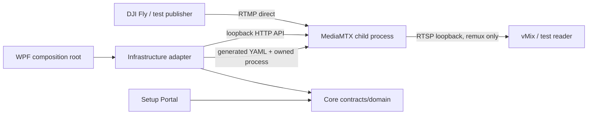
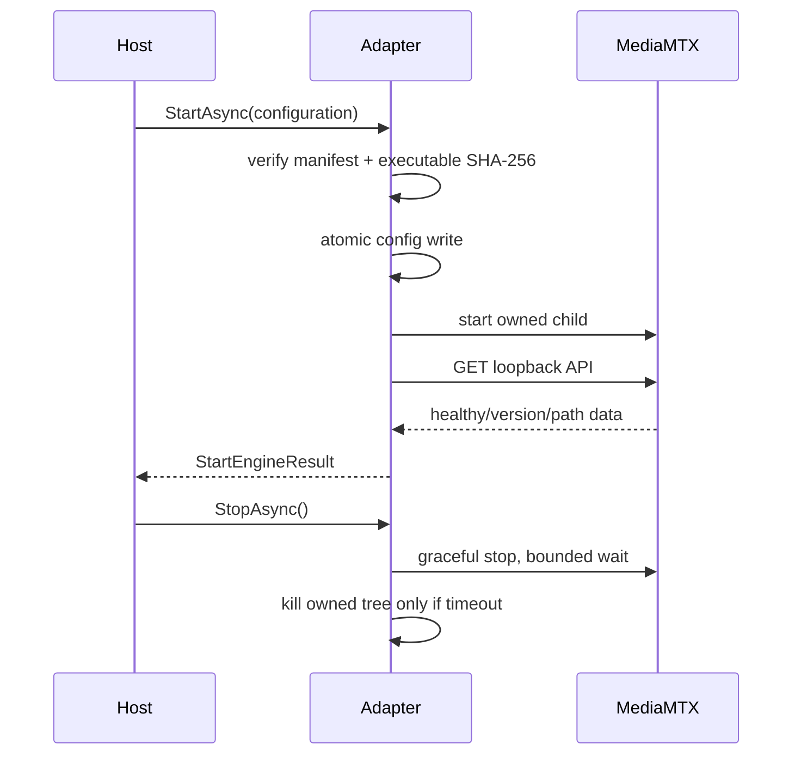

# Architecture — Phase 0 and Phase 1

## Components and boundaries

The media payload never enters WPF and is never decoded, encoded, composited, or
overlaid by application code. MediaMTX routes/remuxes the direct RTMP input to RTSP.

## Process boundaries and lifecycle

The desktop process owns one MediaMTX child. Lifecycle operations are serialized.
Before start, Infrastructure validates the manifest and computes the executable
SHA-256. It atomically writes a generated configuration, launches the verified
binary, continuously drains stdout/stderr into a bounded channel, and waits for a
real loopback API health response. Unexpected exit triggers only the bounded
1s/3s/10s restart sequence. Intentional stop cancels monitoring, requests graceful
termination, applies a timeout, and force-kills only the recorded owned process tree.
On Windows the ownership adapter uses a kill-on-close Job Object; portable test
hosts use explicit parent ownership and process-tree termination.

## Bindings

| Surface | Production default | Phase 1 tests | Exposure |
|---|---|---|---|
| RTMP ingest | selected LAN / `:1935` | dynamic loopback port | LAN only when required |
| RTSP output | `127.0.0.1:8554` | dynamic loopback port | loopback |
| MediaMTX API | `127.0.0.1` | dynamic loopback port | loopback |
| Metrics | `127.0.0.1` | dynamic loopback port | loopback |
| WebRTC | `127.0.0.1` | disabled unless tested | loopback |

Integration tests allocate ports by binding port zero, release immediately before
engine start, and retry startup failures caused by the unavoidable allocation race.

## Configuration and data

Application settings remain the future source of truth. The generated MediaMTX YAML
is a runtime derivative, written via a same-directory temporary file and atomic
replace. Production runtime data belongs under
`%LOCALAPPDATA%\AlIkhsanMedia\DroneVersion\runtime`; tests use isolated temporary
directories and delete them only after owned processes exit.

## Health contract

Core exposes typed `IMediaEngineService`, `MediaEngineHealth`, and path snapshot
records. Only Infrastructure knows MediaMTX HTTP endpoints and DTO schema. JSON
parsing is tolerant of additive fields and maps unknown values to safe domain states.
Health is based on process liveness plus a real API response, never fabricated logs.

## Security/reliability invariants

- No runtime download and no execution before checksum verification.
- API, metrics, RTSP, and future preview are loopback-only by default.
- No credentials, account, activation, Device ID, telemetry, cloud, or paid API.
- No frame manipulation, overlay, watermark, screen capture, or transcoding.
- Cancellation reaches every background operation; process output cannot deadlock.
- The adapter never kills by process name and never terminates an unrelated process.

## Phase 2 portable domain and Windows adapters

Core remains `net8.0` and contains the six-slot aggregate, immutable slot ID,
secure-key rules, schema v2/migration, URL construction, network scoring, stream
state machine, clock abstraction, and diagnostic catalog. It declares Windows
capability contracts without referencing their implementations.

Infrastructure contains real Windows-only DPAPI CurrentUser, Job Object, firewall,
network enumeration/profile, and port-owner adapters. These types fail explicitly
outside Windows; no macOS security substitute exists. macOS uses
`AlIkhsanMedia.Drone.Mac.slnf` to compile/test portable assemblies and the existing
Darwin MediaMTX integration path. The App project itself remains unconditional
`net8.0-windows` WPF. The full solution is built only by Windows CI or a Windows
developer machine.

Settings are validated before persistence, written to a same-directory temporary
file with write-through semantics, then atomically replaced. Invalid/corrupt input
is moved to a UTC timestamped backup before safe defaults are returned. Stream keys
are always generated from 16 cryptographically random bytes and production
envelopes use DPAPI CurrentUser.
